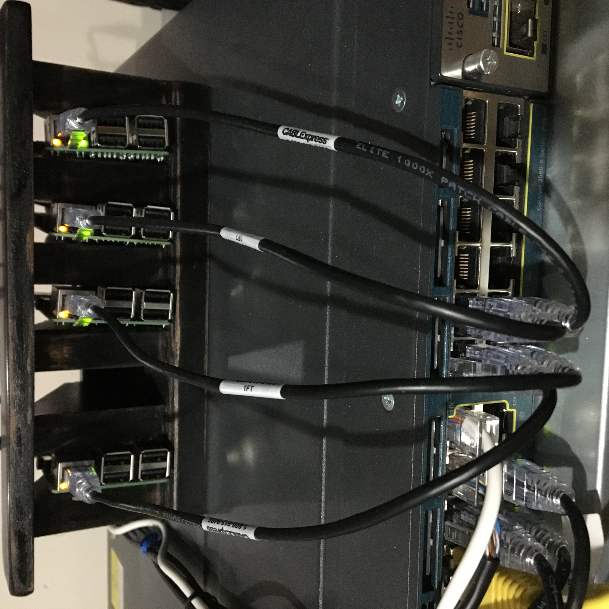

# k3s-setup-on-raspberry-pis

Initial raspberry Pi setup using k3s.io -- Kubernetes cluster on raspberry pi 3s! 

## Prepare the Pis

1.  Install Raspbian Lite to the SD card with Etcher. Be sure to place a file named ".ssh" onto the SD card.
2.  SSH into the Pi (username: pi & password: raspberry) and type:
```bash
sudo raspi-config
```
3. Go to Network Options > Hostname then change the hostname k3s-worker_or_master-#.
4. Set the GPU memory split to 16mb.
5. Change the password for the pi user.
6. Save settings and pi will reboot.
7. SSH back into the Pi and lets set the static IP by doing the following:
```bash
sudo nano /etc/dhcpcd.conf
```
Uncomment to eth0 block to look like the following and save when done:
```bash
interface eth0
static ip_address=x.x.x.y/24
static routers=x.x.x.1
static domain_name_servers=x.x.x.1
```
8. Disable swap by running the following:
```bash
sudo dphys-swapfile swapoff \
&& sudo dphys-swapfile uninstall \
&& sudo update-rc.d dphys-swapfile remove
```
Confirm it worked by running:
```bash
sudo swapon --summary
```
9. Edit the /boot/cmdline.txt by doing:
```bash
sudo nano /boot/cmdline.txt
```
Then add this to the first line in the file (DO NOT CREATE A NEW LINE)
```bash
cgroup_enable=cpuset cgroup_memory=1 cgroup_enable=memory
```
10. Reboot the pi with the following:
```bash
sudo reboot
```
The Pis are now ready to run the cluster! :) 

## Master Node Setup

1. SSH back into the masater pi. Now the pi is ready to have k3s by rancher installed. We will do this by running the following command:
```bash
curl -sfL https://get.k3s.io | sh -

# If you need a specific version run the following:
curl -sfL https://get.k3s.io | INSTALL_K3S_VERSION=v0.9.1 sh -
```
2. After this command finished the following will have been installed: kubectl, crictl, ctr, k3s-killall.sh, and k3s-uninstall.sh
3. Lets now grab the k3 key to allow worker nodes to join. Do this by running the following:
```bash
sudo cat /var/lib/rancher/k3s/server/node-token
```
4. You know have a ready to use master node for kubernetes. Now lets join some worker nodes.

## Worker Node Setup

1. SSH back into each worker pi. Now the pi is ready to have k3s by rancher installed. We will do this by running the following command:
```bash
# - - - - - 
# In the command replace "myserver" with the IP address of the master node
# Then also replace "mynodetoken" with the token we got from the master node when we ran the cat command.
# - - - - - 
curl -sfL https://get.k3s.io | K3S_URL=https://myserver:6443 K3S_TOKEN=mynodetoken sh -

# If you need a specific version run the following:
curl -sfL https://get.k3s.io | K3S_URL=https://myserver:6443 K3S_TOKEN=mynodetoken INSTALL_K3S_VERSION=v0.9.1 sh -
```
2. You now have a ready to use worker node. Confirm its connected to the cluster by running the following command on the master node:
```bash
sudo kubectl get nodes
```

## Local Storage Setup

The most difficult part for me when setting up k3s was figuring out persistent storage. After lots of searching I found the best solution for my case was to use local storage by K3s. Later on I may switch to K3s Longhorn block storage solution. To get localstorage up and running, do the following:

```bash
sudo kubectl apply -f https://raw.githubusercontent.com/rancher/local-path-provisioner/master/deploy/local-path-storage.yaml

# Confirm with
sudo kubectl -n local-path-storage get pod
```

Below is an example PVC that will dynamically have a PV created on a node under this path: /opt/local-path-provisioner
```bash
apiVersion: v1
kind: PersistentVolumeClaim
metadata:
  name: local-path-pvc
  namespace: default
spec:
  accessModes:
    - ReadWriteOnce
  storageClassName: local-path
  resources:
    requests:
      storage: 2Gi
```

Here is a example pod using that PVC:
```bash
apiVersion: v1
kind: Pod
metadata:
  name: volume-test
  namespace: default
spec:
  containers:
  - name: volume-test
    image: nginx:stable-alpine
    imagePullPolicy: IfNotPresent
    volumeMounts:
    - name: volv
      mountPath: /data
    ports:
    - containerPort: 80
  volumes:
  - name: volv
    persistentVolumeClaim:
      claimName: local-path-pvc
```

Please refrence the offical documentation for more information on this here: https://github.com/rancher/local-path-provisioner or go to https://rancher.com/docs/k3s/latest/en/storage

## Helpful Commands

Below are some commands you will most likely be running a lot on your master node.

```bash
# Getting information about various parts of k8s
sudo kubectl get nodes
sudo kubectl get pods
sudo kubectl get pvc
sudo kubectl get service
sudo kubectl get pv
```

```bash
# Deploying and deleting various items from k8s
sudo kubectl apply -f some_k8_item.yaml
sudo kubectl delete -f some_k8_item.yaml
```

```bash
# Getting detailed information about pods
sudo kubectl describe pods
```

## Setting up kubectl on your machine

To get kubectl working on your local machine, first install kubectl by reading through the following documentation for your machine. https://kubernetes.io/docs/tasks/tools/install-kubectl

Next, we will need to setup your kubeconfig file by copying the config from the master to your machine.
```bash
# This is the IP of your master node
scp pi@x.x.x.y:/etc/rancher/k3s/k3s.yaml ~/.kube/config 
```

## Function As A Service on k3 cluster

To run functions as a servie on your cluster visit https://docs.openfaas.com/deployment/kubernetes/#c-deploy-using-kubectl-and-plain-yaml-for-development-only


## My Setup


